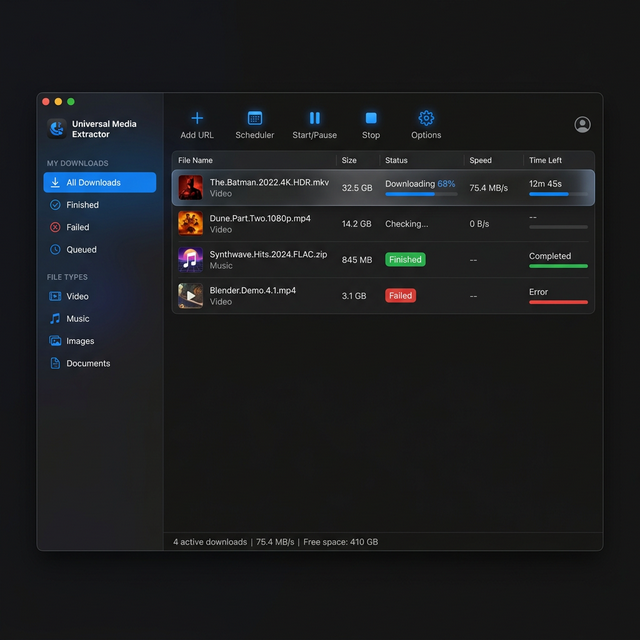

# Universal Media Extractor 🚀

A professional, high-performance desktop media downloader built with Electron and Python. Inspired by modern download managers, it provides a premium experience for extracting media from over 1700+ websites.



## 💎 Features

Our application is designed for power users who demand speed, reliability, and precision.

### 🎥 Superior Extraction
- **Wide Support**: Extracts media from 1700+ platforms including YouTube, Facebook, Twitter, and more.
- **Precision Quality**: Choose between 4K (2160p), 1080p, 720p, and other resolutions.
- **Batched Engine**: Powered by a robust `yt-dlp` core for maximum extraction performance.

### 🛡️ Professional Control
- **Intelligent Scheduler**: Automate your extractions by setting specific start and stop times.
- **Power Management**: Automatically Shutdown, Sleep, or Lock your PC once all extractions are finished.
- **Bandwidth Control**: Built-in Global Speed Limiter to save your data for other tasks.
- **Queue Priority**: Manually prioritize which media gets extracted first.

### 🎨 Premium UI/UX
- **Luxury Dark Theme**: A deep, charcoal-based interface with vibrant blue accents.
- **Smart Categorization**: Automatically filters your history into Video, Music, Documents, and more.
- **Contextual Actions**: Advanced right-click menu for quick folder opening, link copying, and redownloading.
- **Native Notifications**: Stay updated with professional Windows toast notifications.

## 🛠️ Technology Stack

- **Frontend**: Electron.js, Vanilla HTML5, Premium CSS3
- **Backend Core**: Python 3
- **Extraction Engine**: yt-dlp
- **Signal Processing**: FFmpeg (for professional media merging)

## 🚀 Getting Started

### Prerequisites
1. **Node.js**: [Download here](https://nodejs.org/)
2. **Python 3**: [Download here](https://www.python.org/)
3. **FFmpeg**: Ensure ffmpeg is installed and available in your project's `resources/bin` directory.

### Quick Setup

1. **Clone the Repository**
   ```bash
   git clone https://github.com/mirhassanmarhamcare/YT-DLP.git
   cd YT-DLP
   ```

2. **Install Dependencies**
   ```bash
   npm install
   ```

3. **Install Core Engine**
   ```bash
   pip install -U yt-dlp
   ```

4. **Launch Application**
   ```bash
   npm start
   ```

## 🏗️ Project Structure

```bash
├── main.js           # Electron Main Process (System Integration)
├── renderer.js       # Extraction Logic & UI Management
├── index.html        # Premium Dashboard Interface
├── engine.py         # Universal Extraction Engine
├── resources/        # Binary assets (yt-dlp, FFmpeg)
└── screenshots/      # Product visual documentation
```

## 📜 License

This project is licensed under the ISC License - see the [LICENSE](LICENSE) file for details.

---
Built with ❤️ by [Mir Hassan](https://github.com/mirhassanmarhamcare)
